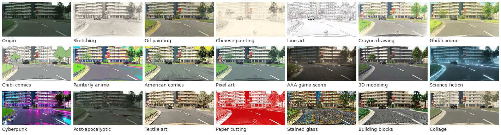

# Concept Blindspots in Object Detection

DetSAE identifies task-relevant concepts inside a frozen object detector. Tracking paired source objects across appearance changes reveals concept clusters associated with excess detection loss. These blindspots then help rank new images by missed-object risk.

## Cityscapes 20-Style Dataset

**Coming soon, subject to authorization.** The [Cityscapes license](https://www.cityscapes-dataset.com/license/) restricts redistribution of original and modified images. We are actively seeking permission to release our 20-style bank. See **[Cityscapes: license, dataset composition, and generation guide](Cityscapes/README.md)** for the specific terms, image-editor options, prompts, and manual quality checks.

## Packages

Download the following assets from this repository's Releases page:

| File | Contents |
| --- | --- |
| `concept-blindspots-models-v1.0.zip` | Frozen detector, DetSAE, three risk MLP checkpoints, configurations, and inference code |
| `concept-blindspots-statistics-v1.0.zip` | Source training statistics, paired concept tests, intervention records, and six-domain risk scores |

Extract both archives into this repository. They create `models/` and `statistics/` alongside the code.

```bash
python -m pip install -r requirements.txt
python scripts/evaluate_statistics.py
python scripts/evaluate_statistics.py --models models --device cuda
```

`evaluate_statistics.py` computes metrics from saved scores; `--models models` also runs the risk MLPs on pooled features. Results are saved to `outputs/risk_metrics.csv` as fractions.

## Run on Local Images

```bash
python scripts/predict.py --images /path/to/images --device cuda
```

The output contains predicted detections and image risk scores. `outputs/predictions.csv` lists images from highest to lowest predicted missed-object count. For a benchmark subset, pass its manifest:

```bash
python scripts/predict.py --images /path/to/images \
  --manifest data/splits/bdd100k.json --output outputs/bdd100k.pt
```

See [data preparation and evaluation](data/README.md) for labels and subset settings.

## Reproduce the Source Analysis

```bash
OPENBLAS_NUM_THREADS=4 python scripts/discover_blindspots.py
python scripts/train_risk.py --device cuda
python scripts/summarize_interventions.py
```

See the [reproduction guide](docs/reproduction.md) for model settings and metric definitions, and [comparison methods](docs/comparisons.md) for the external methods and their references.

## Appearance Transformations



One [Cityscapes](https://www.cityscapes-dataset.com/) scene and its 20 style-transferred views. Source imagery belongs to the Cityscapes rights holders; the transformations were produced for this study. See the [generation guide](Cityscapes/README.md) for details.

Please report copyright, privacy, or other rights concerns through the repository's Issues page. Affected material will be promptly hidden or removed during review.

## Datasets

| Dataset | Original publication | Data |
| --- | --- | --- |
| Cityscapes | [The Cityscapes Dataset for Semantic Urban Scene Understanding](https://openaccess.thecvf.com/content_cvpr_2016/html/Cordts_The_Cityscapes_Dataset_CVPR_2016_paper.html) | [Website](https://www.cityscapes-dataset.com/), [20-style dataset](Cityscapes/README.md) |
| BDD100K | [BDD100K: A Diverse Driving Dataset for Heterogeneous Multitask Learning](https://openaccess.thecvf.com/content_CVPR_2020/html/Yu_BDD100K_A_Diverse_Driving_Dataset_for_Heterogeneous_Multitask_Learning_CVPR_2020_paper.html) | [Website](https://www.bdd100k.com/) |
| KITTI | [Are We Ready for Autonomous Driving? The KITTI Vision Benchmark Suite](https://www.cvlibs.net/publications/Geiger2012CVPR.pdf) | [Website](https://www.cvlibs.net/datasets/kitti/) |
| RealDriveSim | [RealDriveSim: A Realistic Multi-Modal Multi-Task Synthetic Dataset for Autonomous Driving](https://arxiv.org/abs/2506.16319) | [Website](https://realdrivesim.github.io/), [6,000-image subset](data/realdrivesim/README.md) |
| SIM10K | [Driving in the Matrix: Can Virtual Worlds Replace Human-Generated Annotations for Real World Tasks?](https://arxiv.org/abs/1610.01983) | [Website](https://fcav.engin.umich.edu/projects/driving-in-the-matrix) |
| Foggy Cityscapes | [Semantic Foggy Scene Understanding with Synthetic Data](https://arxiv.org/abs/1708.07819) | [Website](https://people.ee.ethz.ch/~csakarid/SFSU_synthetic/) |
| Rainy Cityscapes | [Depth-Attentional Features for Single-Image Rain Removal](https://openaccess.thecvf.com/content_CVPR_2019/html/Hu_Depth-Attentional_Features_for_Single-Image_Rain_Removal_CVPR_2019_paper.html) | [Website](https://www.cityscapes-dataset.com/downloads/) |

### RealDriveSim 6,000-Image Subset

The [RealDriveSim](https://realdrivesim.github.io/) subset contains **6,000 original-view images: 2,520 Day, 2,580 Adverse-A, and 900 Adverse-B**. Download the images and detection labels from the [dataset release](../../releases/tag/realdrivesim-6000-v1.0) and extract all ZIP parts into one directory. See the [subset guide](data/realdrivesim/README.md) for labels, evaluation commands, and attribution under [CC BY 4.0](https://creativecommons.org/licenses/by/4.0/).

## Terms

Code is provided under the [MIT license](LICENSE). Model weights and derived statistics are for non-commercial research and remain subject to the [applicable data terms](DATA_TERMS.md). Third-party datasets retain their original licenses.
